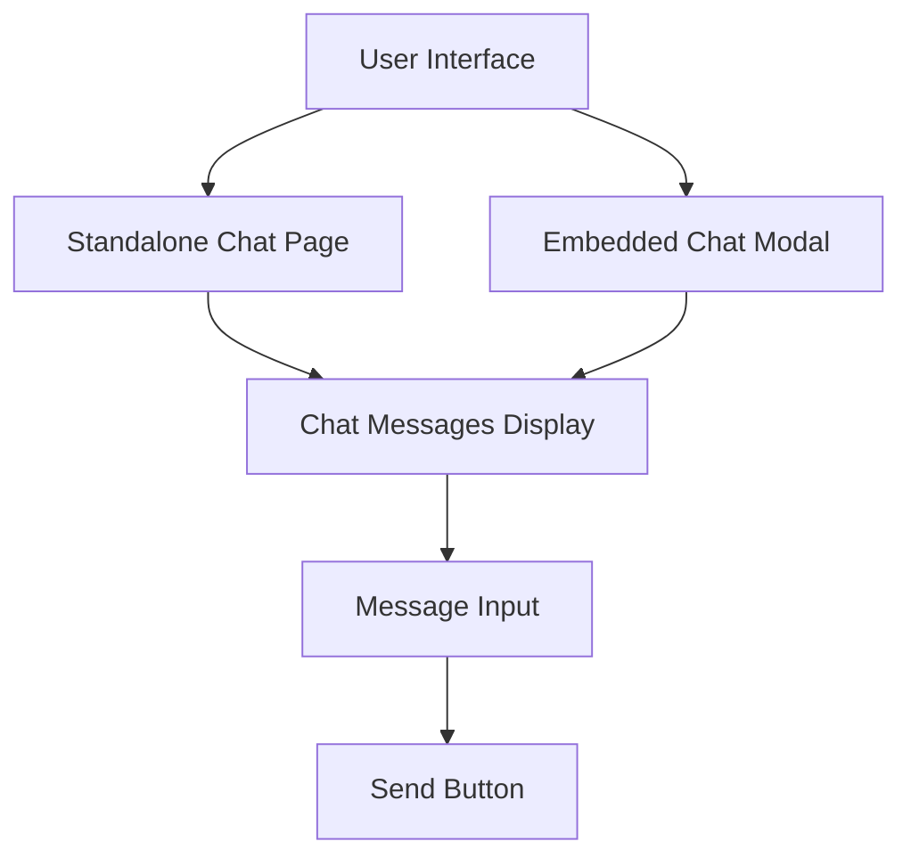
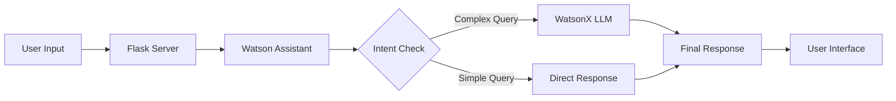

Here's a detailed explanation of how this mental health chatbot system works:

# Mental Health Chatbot System Overview

## Architecture Components

### 1. Frontend Interface
- Built using HTML, CSS, and JavaScript
- Features both a standalone chat page (`chat.html`) and an embedded chat modal in the main site (`index.html`)
- Responsive design that works on both desktop and mobile devices

### 2. Backend Server
- Built with Flask (Python)
- Handles routing and API endpoints
- Manages communication between frontend and AI services

### 3. AI Integration
- Uses two IBM AI services:
  - Watson Assistant: For intent classification and basic responses
  - WatsonX (LLaMA model): For more complex, empathetic responses

## How It Works

### 1. User Interface

The system provides two ways to access the chat:
- Standalone page at `/chat`
- Modal popup triggered by "Ask Watson", "Talk to AI", or "Get Help" buttons

### 2. Message Flow

When a user sends a message:
1. Message is sent to Flask server
2. Server forwards to Watson Assistant for intent classification
3. Based on intent:
   - Simple queries: Handled by Watson Assistant
   - Complex queries: Processed by WatsonX for more nuanced responses
4. Response is returned to user interface

### 3. Session Management
- Uses custom session handling with 30-minute timeout
- Maintains conversation history for context
- Handles authentication and API tokens for IBM services

### 4. AI Response Generation
The WatsonX model is specifically prompted for mental health support:
- Focuses on empathetic responses
- Provides actionable advice
- Maintains professional boundaries
- Includes content moderation for safety

## Key Features

### 1. Security
- API key encryption
- Content moderation
- PII (Personal Identifiable Information) filtering
- Secure token management

### 2. User Experience
- Real-time message updates
- Typing indicators
- Error handling
- Mobile-responsive design

### 3. AI Capabilities
- Context awareness
- Empathetic responses
- Mental health-focused prompting
- Fallback mechanisms

## Technical Implementation Details

### Frontend
- Uses modern JavaScript for async communication
- Implements responsive design with Tailwind CSS
- Handles real-time UI updates
- Manages chat state and history

### Backend
- RESTful API endpoints
- Error handling and logging
- Session management
- API integration with IBM services

### AI Integration
- Custom prompting for mental health context
- Conversation history management
- Intent classification
- Response generation and moderation

## Deployment Considerations
- Environment variable management for API keys
- Error logging and monitoring
- Rate limiting
- Scalability considerations

This system provides a comprehensive mental health support chatbot that combines the strengths of multiple AI services while maintaining a focus on user safety and experience.

